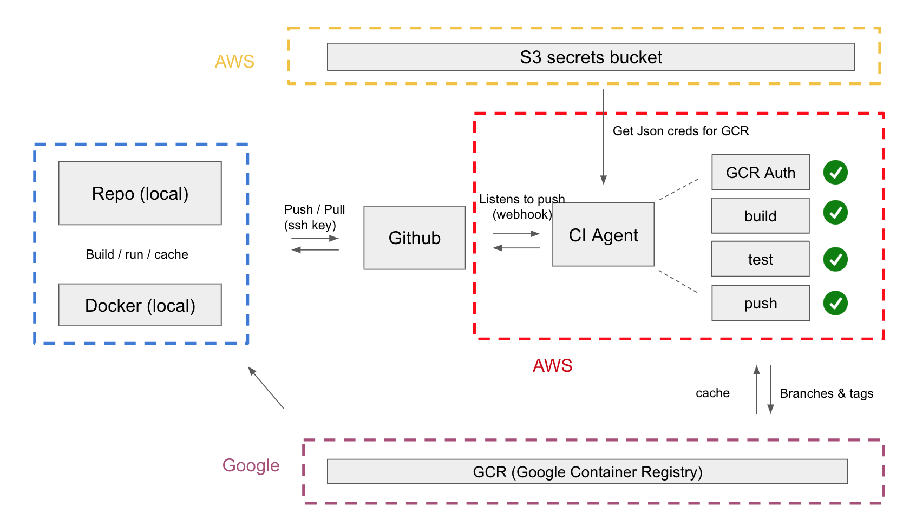

Example of batch ETL in Apache Airflow
===============================================================================
This is an example of how you would structure the codebase of an ETL pipeline using Airflow. This is not a functioning project, but is meant to give an idea of the project structure and DAG syntax. I did not fork or rewrite any parts of the original `airflow=1.10.0`. The dependencies in the files `./docker/conda_*` should be interpreted as a list of packages that I selected over time. They are not required in any project, and certainly not required to test airflow locally.

## Why Airflow?

[Airflow](https://github.com/apache/airflow) is one of [a few](https://paper.dropbox.com/doc/Tooling-Workflow-Orchestration--Aj21verpo8ROSiat0UeaGkV3Ag-i7ey1rnUSEEvIQaFAcuQz) python-based open source tools to author and schedule workflows. You can think of it as a **much better chron**. It is often used to manage batch data pipelines known as ETL (Extract Transform Load). It was developed by Airbnb and open sourced in 2015. Google offers a managed version under the name of [Cloud Composer](https://cloud.google.com/composer/).

**Note**: *In a managed service a lot of details are abstracted away. Speed and easy of use sometimes comes at the cost of flexibility and there are [number of factors](https://paper.dropbox.com/doc/Cloud-Composer--Aj2xjfXGAtMaEP~LvV4uaPzoAg-q14602O2N3PoxXP3xLnlt) to be consider.*  

Airflow is built around four core principles:

  + **Transactional**: A piece of computation should either succeed or fail. You should not provision for things like “partially succeeded”.
  + **Idempotent**: When you re-run the same code for the same part of the pipeline you should get ALWAYS the same result.
  + **Resilient**: Designed for failure. Any data comes from somewhere and things have bugs/get improved along the way.
  + **Zero-Administration**: Once the logic is defined, scaling out should be straightforward.

The principle of zero-administration results from a separation of concerns. The definition of tasks in Directed Acyclic Graphs (DAGs), task scheduling, and task execution, are handled by different agents. This allows the system to scale horizontally leveraging container orchestration engines such as [kubernetes](https://kubernetes.io/). To keep in mind - vanilla Airflow is a task management tool, not a resource optimisation tool. In practice this means that in single-node applications you are responsible for balancing load and optimise resource utilisation.  

#### What Airflow IS NOT

Depending on how data is collected before the transformation (T) step, ETL pipelines can be based on **batch** or **stream** processing.

**Airflow is not** a stream processing tool. Although it is possible to run batch jobs every 15 minutes, even simple aggregations over larger time windows require to write additional code and are just cumbersome. If your application requires real time processing, consider using tools like [Spark Streaming](https://spark.apache.org/streaming/), [Apache Samza](http://samza.apache.org/), or [Apache Beam](https://beam.apache.org/). There is also a managed version of the latter in GCP, under the name of [Dataflow](https://cloud.google.com/dataflow/). This doc might be a good starting point.

**Airflow is not** a language-agnostic workflow orchestration tool. It is written in python and most of the code you can run natively is python code. The bash_operator can be used to execute arbitrary code, but you still need a python environment and Airflow itself is still interpreted. If you need a language-agnostic tool, checkout [pachyderm](http://pachyderm.io/) and have a look at this [post](http://gopherdata.io/post/more_go_based_workflow_tools_in_bioinformatics/).

#### DAG Orchestration

This is where the work is broken down into atomic pieces (**tasks**), connected with each other by a set of dependencies to form a directed acyclic graph (**DAG**). In order to achieve transactional execution, it is not recommended to pass state between tasks. If your code can tolerate a machine restart at any point of the execution of a DAG, you can be reasonably sure that the code is idempotent and transactional. A task is an instance of one of the many Airflow [operators](https://airflow.readthedocs.io/en/stable/_api/airflow/operators/index.html), most notably the bash_operator to run arbitrary commands, the PythonOperator to interpret and execute python code.

#### State
Airflow keeps the state of each DAG in a relational database (OLTP - Online Transactional Processing). Options are MySQL and PostgreSQL, although the first is not ideal in large projects for reasons related to concurrency. In this repo, I use a local PostgresQL dB, deployed and mounted via the `docker_compose.yml` file.

#### Single-Node Execution
There are two executors available:

  + **SequentialExecutor**: One task at a time.
  + **LocalExecutor**: Concurrent task execution.

#### Scaling out

When the cores on your VM are not enough to get the job done, you can scale out Airflow in at least [two ways](https://paper.dropbox.com/doc/Scaling-Out-Airflow--Aj0ISuhrbfc7CmwPNMbHyhgBAg-NFbqIBfvkevcVOj7huwT3). The first uses a distributed task queue called [Celery](http://www.celeryproject.org/), the second leverages the scalability of kubernetes with the [KubernetesPodOperator](https://airflow.readthedocs.io/en/stable/kubernetes.html). In this second case, each task runs in an isolated k8s pod with its own Docker image, logs, metrics and replay logic, for ultimate flexibility and scalability. The scheduler and webserver deamons also run inside two separate pods. Just like all distributed systems though, consistency between environments of different pods can be tricky, but the problem [has been solved](https://www.youtube.com/watch?v=A0gKV1r7w8M&feature=youtu.be).

## Deployment
Airflow is often deployed to connect existing databases, endpoints, caches and queues together, and automate the process of data cleaning, ingestion, and notifications (slack, pagerduty etc).
In the example below, Airflow periodically fetches data from a variety of databases, cleans and equalises it, defines a schema and ingests it partitioned tables in BigQuery. It also invalidates and reset caches, creates views and materialised views, and posts stack traces to Slack when something goes wrong.

#### CI-CD
In my last company CICD was done in Buildkite, with agents deployed in AWS. At a high level, each commit triggered a rebuild of the image (being careful to use Docker layers appropriately to avoid rebuilding every time). In order to work, the full ETL application needs the helpers, an assets repo (where the business logic is defined), and a BI repo.

#### Lessons learned

[*if I was to redo this today I would host the repo in gitlab and leverage their CICD integration to simplify things*]

## Warehouse Architecture - Star

An example of how Airflow can be used is periodically ingest data to a OLAP database. This is a high level architecture of a normalised database. The idea is to have a fact table in the centre, with foreign keys pointing to external tables containing domain specific information. Such a `normalized` structure allows to minimise data duplication (meaning that when you want to delete something sensitive there is only one place to look at).

Check out this [doc](https://drive.google.com/file/d/1ILuw3NoVagm6aHLgFsjIImx3ZGGot6Zq/view?usp=sharing) for an idea of how such fields might be structured. For an example of an SQL query written for Google Big Query in Standard SQL check out `/sql_samples`

#### Table partitioning

#### Dataset locations

#### Lessons learned

## Airflow Configuration

Inside `airflow.cfg` or via environment variables. Variables should be named as follows:

    AIRFLOW__X__Y

where X is the section of the config file in capital letters (e.g. CORE), Y is the particular parameter in capital letters (e.g. REMOTE_LOGGING), and __ is a double underscore. So to setup the SQLAlchemy string to talk to your dB of choice, the name of the env variable will be **AIRFLOW__CORE__SQL_ALCHEMY_CONN**.

## Repo secrets

This repo uses [transcrypt](https://github.com/elasticdog/transcrypt) to transparently encrypt/decrypt the `/secrets` directory  with **aes-256-cbc** cypher (test password is `airflow`). During remote deployment in a node/cluster, the decryption key can be read from an authenticated bucket (e.g. Amazon S3). Transcrypt is included as a submodule, so to clone the repo use:

`git clone --recurse-submodules https://github.com/LorisMarini/helpers.git`

To setup transcrypt simple run

`decrypt-secrets.sh MYSECRET` replacing MYSECRET as appropriate. To see what is being encrypted, cd into the repo and type `git ls-crypt`. To change this, modify the file `.gitattributes`.
